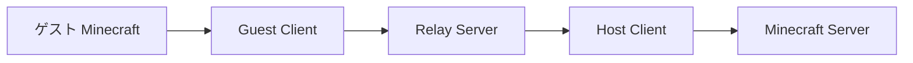
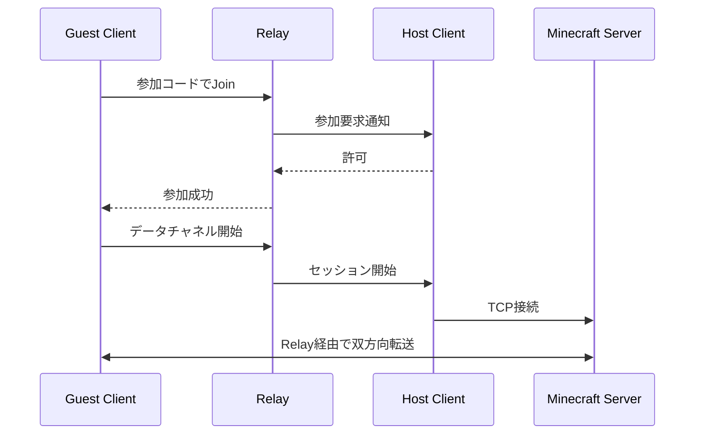

# 03 システム構成

## 1. 全体構成



ホスト・ゲストのMineLinkクライアントはRelayへ外向き接続を確立する。ゲストのMinecraftは、MineLinkが`127.0.0.1`に開くポートへ接続する。

## 2. 技術構成

| レイヤー | 技術 |
|---|---|
| GUI | WinUI 3 / XAML |
| アプリケーション | C# / .NET 10 |
| MVVM | CommunityToolkit.Mvvm |
| DI・設定 | Microsoft.Extensions.DependencyInjection / Configuration |
| HTTP API | HttpClient |
| 制御通信 | WebSocket over TLS |
| データ通信 | TCP over TLS（初版） |
| ログ | Serilog |
| Relay | ASP.NET Core + BackgroundService |
| DB | PostgreSQL |
| キャッシュ | 初版はメモリ、必要時Redis |

## 3. ソリューション構成

```text
MineLink.sln
├─ src/
│  ├─ MineLink.App/           # WinUI 3、View、ViewModel
│  ├─ MineLink.Application/   # ユースケース、状態管理
│  ├─ MineLink.Core/          # トンネル、暗号化、ポート管理
│  ├─ MineLink.Contracts/     # API DTO、通信メッセージ
│  ├─ MineLink.Infrastructure/# HTTP、WebSocket、設定、ログ
│  └─ MineLink.Relay/         # 中継サーバー
└─ tests/
   ├─ MineLink.UnitTests/
   └─ MineLink.IntegrationTests/
```

## 4. クライアント内部責務

| コンポーネント | 責務 |
|---|---|
| RoomService | ルーム作成、参加、退出 |
| RelayConnection | Relayとの接続、再接続、ハートビート |
| LocalPortListener | `127.0.0.1`のTCP待受 |
| TunnelSession | Minecraft接続1本とRelayデータチャネルの対応付け |
| ServerProbe | Minecraft Serverの起動・疎通確認 |
| AppState | 接続状態と画面表示状態の一元管理 |
| SettingsService | ローカル設定の読込・保存 |
| LogService | 利用者向けログと診断ログの出力 |

## 5. 接続シーケンス



## 6. 状態管理

| 状態 | 意味 |
|---|---|
| Disconnected | Relay未接続 |
| Connecting | 接続処理中 |
| Hosting | ルーム公開中 |
| Joined | ルーム参加済み、ローカル待受中 |
| Reconnecting | 一時切断から復旧中 |
| Error | 継続不能なエラー |

