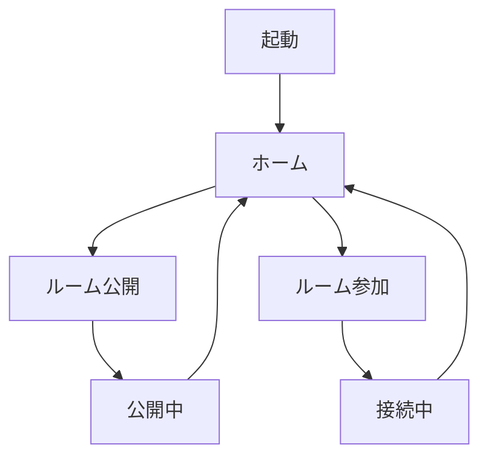

# 04 GUI画面設計

## 1. デザイン方針

- Windows 11のFluent Designに合わせる。
- ダークテーマを初期値とし、ライト・システム連動を選択可能にする。
- 主要操作は「公開する」「参加する」の2つに絞る。
- ネットワーク用語を極力画面に出さない。
- 成功は緑、処理中は青、警告は黄、失敗は赤で表現する。
- 色だけに依存せず、アイコンと文言を併用する。
- 接続中にウィンドウを閉じた場合はシステムトレイへ格納する。

## 2. テーマ

| 要素 | 初期案 |
|---|---|
| 背景 | Mica Alt / ダークグレー |
| メインカラー | エメラルドグリーン |
| アクセント | Minecraftを連想する明るい緑 |
| 角丸 | 8px〜12px |
| フォント | Segoe UI Variable |
| アイコン | Fluent System Icons |

## 3. 画面一覧

| ID | 画面 | 主な役割 |
|---|---|---|
| UI-01 | 初回セットアップ | 表示名、エディション、既定ポート設定 |
| UI-02 | ホーム | 公開・参加への入口、現在状態 |
| UI-03 | ルーム公開 | 接続先設定、参加コード、接続者一覧 |
| UI-04 | ルーム参加 | 参加コード入力、ローカル接続先表示 |
| UI-05 | 通信状況 | Ping、送受信量、セッション表示 |
| UI-06 | ログ | 利用者向けイベントと診断情報 |
| UI-07 | 設定 | テーマ、ポート、起動、ログ設定 |
| UI-08 | エラーダイアログ | 原因、対処、再試行操作 |

## 4. ホーム画面

```text
┌─────────────────────────────────────────────┐
│ MineLink                         ● 待機中   │
├────────────┬────────────────────────────────┤
│ ホーム     │ Minecraftで一緒に遊ぼう       │
│ ルーム     │                                │
│ 通信状況   │ ┌──────────┐  ┌──────────┐    │
│ ログ       │ │ 公開する │  │ 参加する │    │
│ 設定       │ └──────────┘  └──────────┘    │
│            │                                │
│            │ 最近使用した設定               │
│            │ Java / localhost:25565          │
└────────────┴────────────────────────────────┘
```

## 5. ルーム公開画面

### 入力項目

| 項目 | 初期値 | 検証 |
|---|---|---|
| エディション | Java | 初版はJava固定 |
| サーバーアドレス | 127.0.0.1 | ローカルアドレス推奨 |
| サーバーポート | 25565 | 1〜65535 |
| 最大参加人数 | 5 | 1〜10 |
| 参加承認 | 自動承認 | 自動／手動 |

### 公開後の表示

- 6〜8文字の参加コード
- コピー、有効期限更新、公開停止ボタン
- 接続者の表示名、Ping、接続時刻
- 接続者ごとの切断ボタン
- Minecraft Serverへの疎通状態

## 6. ルーム参加画面

| 項目 | 内容 |
|---|---|
| 参加コード | 自動で大文字化し、空白とハイフンを無視する |
| 表示名 | 1〜16文字、禁止文字を検証する |
| ローカルポート | 自動選択、詳細設定で変更可能 |

接続後は`localhost:25565`を大きく表示し、「コピー」「Minecraftを起動」「切断」を提供する。

## 7. 画面遷移



## 8. エラー表示例

| コード | 表示文言 | 操作 |
|---|---|---|
| CLIENT-PORT-001 | 使用するポートが他のアプリで使われています | 別ポートを自動選択 |
| HOST-PROBE-001 | Minecraft Serverに接続できません | 再確認／設定を開く |
| ROOM-CODE-001 | 参加コードが見つからないか、期限切れです | 再入力 |
| RELAY-CONN-001 | 中継サーバーへ接続できません | 再試行 |
| VERSION-001 | MineLinkの更新が必要です | 更新画面を開く |

